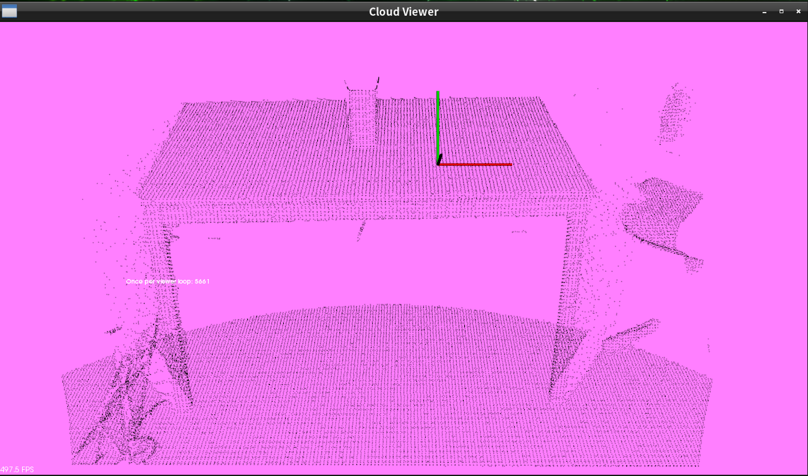
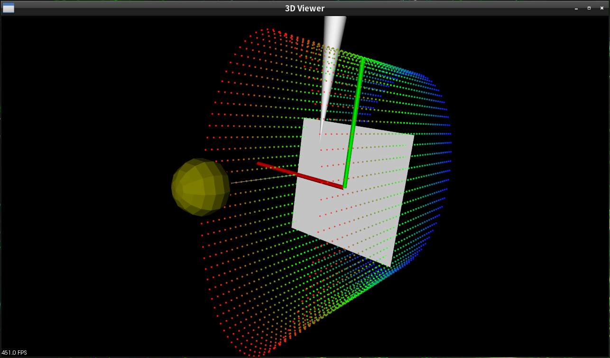
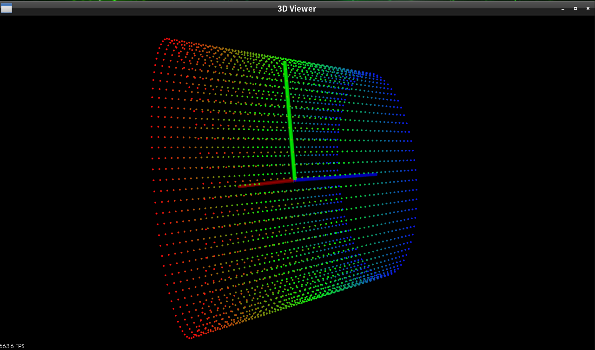
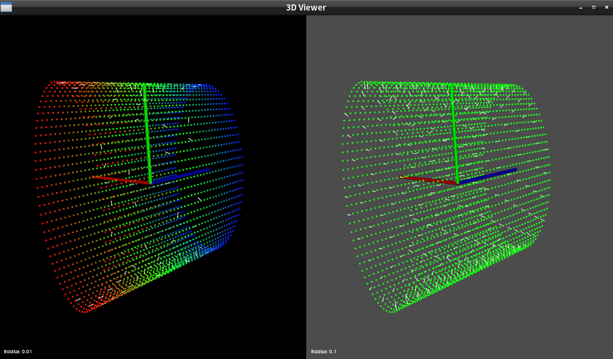
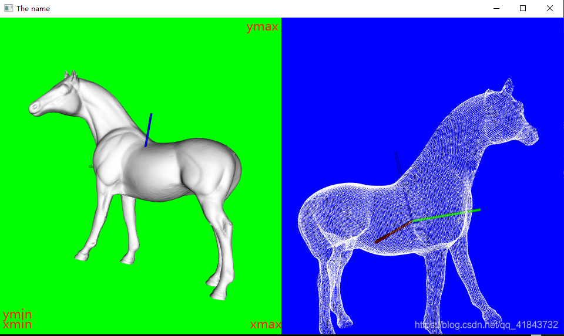
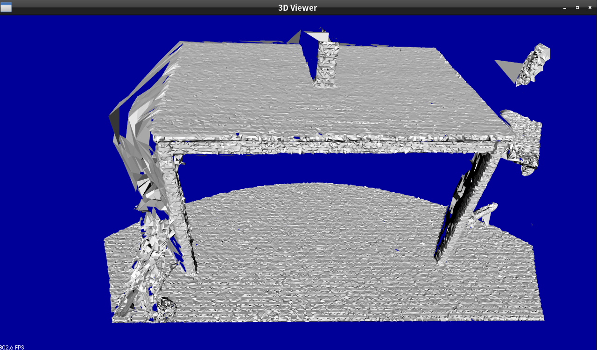
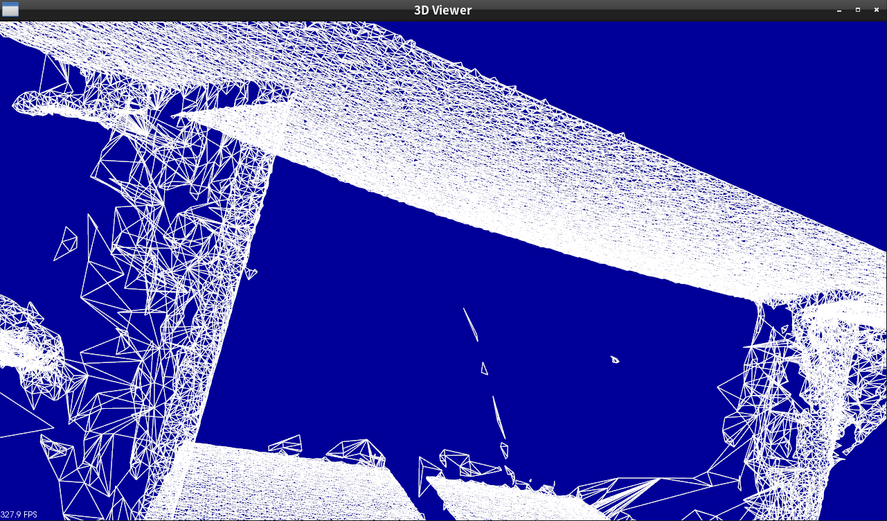

# PCL库点云可视化与重建实例

[toc]

------

## 点云可视化｜cloud_viewer
[cloud viewer实例](https://github.com/doubleZ0108/Play-with-NVIDIA-Jetson-Nano/tree/master/PCL/cloud_viewer)

## pcd可视化｜pcl_visualizer_demo
[pcl visualizer demo实例](https://github.com/doubleZ0108/Play-with-NVIDIA-Jetson-Nano/tree/master/PCL/pcl_visualizer_demo)

## ply可视化
[ply可视化实例](https://github.com/doubleZ0108/Play-with-NVIDIA-Jetson-Nano/tree/master/PCL/ply_transformer_demo)
> 读取.ply功能正常，显示ply点云暂时有问题未解决
> 网上的运行效果
>
> 

## 曲面重建｜三角化
[曲面重建实例](https://github.com/doubleZ0108/Play-with-NVIDIA-Jetson-Nano/tree/master/PCL/triangulation)

## Resources
- [pcl_visualizer_demo解决undefined reference to ‘boost::this_thread::hiden::sleep_until(timespec const$_Dbojuedzw的博客-CSDN博客](https://blog.csdn.net/Dbojuedzw/article/details/105396024)
- [PCL: Surface模块之GreedyProjectionTriangulation表面重建_宫保鸡丁-CSDN博客](https://blog.csdn.net/u012337034/article/details/37924523)
- [pcl曲面网格模型的三种显示方式 - 薄小成 - 博客园](https://www.cnblogs.com/bozhicheng/p/5842747.html)
- [PCL学习笔记（1）-可视化（2）--pcl_visualizer_demo_yby1271的博客-CSDN博客](https://blog.csdn.net/yby1271/article/details/69524357)
- 转换ply文件
	- [pcl库显示stl文件或者二进制ply文件 - 华为云](https://www.huaweicloud.com/articles/db421a58b504233d22b0b7e25cd1fe1f.html)
	- [PCL：读取ply，pcb格式文件显示效果_Charles_ke的博客-CSDN博客](https://blog.csdn.net/Charles_ke/article/details/86597223)
	- [VTK - Users - vtk PLY reader errors](http://vtk.1045678.n5.nabble.com/vtk-PLY-reader-errors-td5732777.html)
	- [【点云可视化】自制ply文件并使用open3d可视化点云_GXLiu-CSDN博客](https://blog.csdn.net/weixin_43486780/article/details/108578048)
