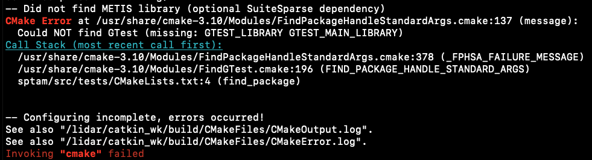

# Linux配置S-PTAM环境
#创乐 Invix/ROS#

> 官方repo：[GitHub - lrse/sptam: S-PTAM: Stereo Parallel Tracking and Mapping](https://github.com/lrse/sptam#installation)

## 安装依赖
按照官方列表安装，但一定要注意两点：
1. 如果不需要Loop Closing capabilities ，则不需要安装 DBoW2 和 OpenGV dependencies，之前全部依赖都安装编译的时候一直报错
2. 要使用`git clone git@github.com:RainerKuemmerle/g2o.git`形式，不要使用`https://`形式
3. `clone`完要`checkout`官方推荐的commit
> 如果第一条使用的是`https://`形式，在`checkout`时会提示找不到
> 如果clone git@格式时报错没有访问权限，可以搜索Git配置ssh [[Git SSH环境配置]]
> checkout之后可以使用`git log`查看当前的`HEAD`是否指向官方推荐的版本
> 这里最开始不听话重装了好几次（血泪的教训啊）


## 编译项目
将官方repo clone到`catkin_wk/src`目录下
并按照官方指令编译
还是要注意， 如果不需要Loop Closing capabilities，不需要执行submodule操作

【报错：— Did not find METIS library (optional SuiteSparse dependency)
**CMake Error** at /usr/share/cmake-3.10/Modules/FindPackageHandleStandardArgs.cmake:137 (message):】




解决方案：https://github.com/lrse/sptam/issues/42
```bash
cd /usr/src/gtest/
mkdir build && cd build
sudo cmake .. -DBUILD_SHARED_LIBS=ON
make
sudo make install
```

【报错：**fatal error:**opencv2/xfeatures2d.hpp: No such file or directory】
opencv由于部分有版权问题，因此直接安装opencv后使用过程中会遇到一些文件找不到
解决方案：[[Linux安装opencv和opencv_contrib]]