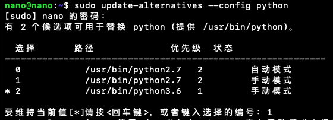
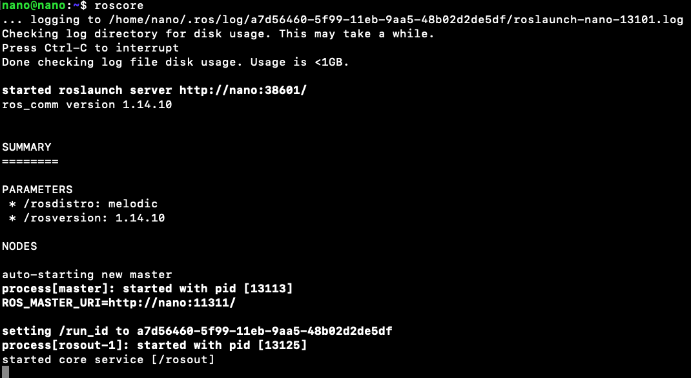
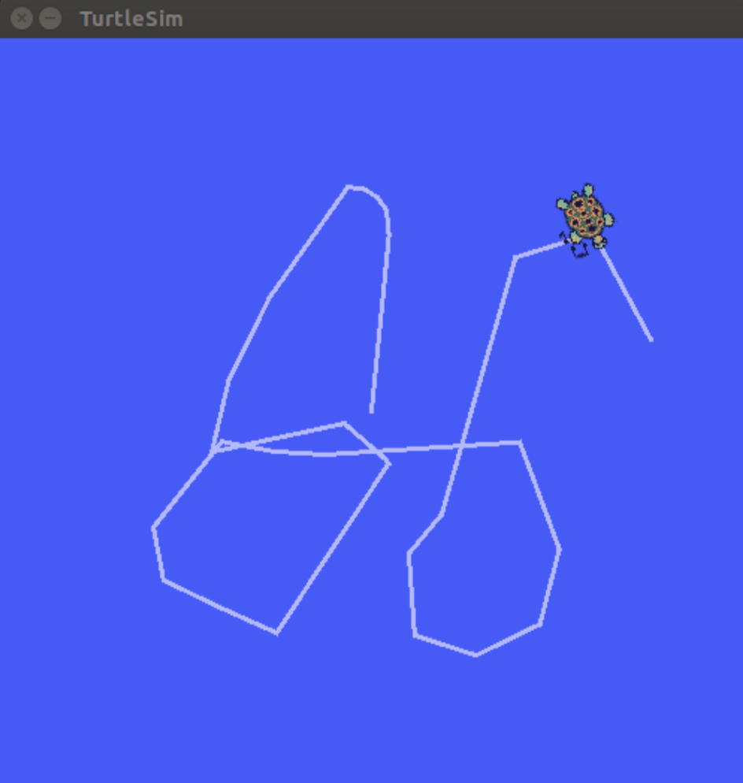

# Jetson Nano安装ROS，有你想知道的所有填坑方法(自信)

1. 让Jetson Nano接受packages.ros.org的安装包
```bash
sudo sh -c 'echo “deb http://packages.ros.org/ros/ubuntu $(lsb_release -sc) main” > /etc/apt/sources.list.d/ros-latest.list'
```
2. 新增apt key
```bash
sudo apt-key adv —keyserver hkp://ha.pool.sks-keyservers.net:80 —recv-key 421C365BD9FF1F717815A3895523BAEEB01FA116
```
3. 更新apt
```bash
sudo apt update
```
4. 安装ROS
```bash
sudo apt install ros-melodic-desktop
```
> ROS Desktop Full是更完整的版本，但是不推荐在嵌入式平台使用
> 因为2D/3D的模拟器都会同时安装上去，会使ROM占用太多空间，并且可能会因为计算量太大而无法在Jetson Nano上使用
5. rosdep初始化
```bash
sudo rosdep init
```
【报错一：pkg_resources.DistributionNotFound: The 'rosdep==0.20.0' distribution was not found and is required by the application】
更换python版本为python2


【报错二：ERROR: cannot download default sources list from:
https://raw.githubusercontent.com/ros/rosdistro/master/rosdep/sources.list.d/20-default.list
Website may be down.】
手动创建该文件（要先一层层的创建目录，再创建20-default.list文件
```bash
cd ~/usr/local/etc/
mkdir -p ros/rosdep/sources.list.d
vim 20-default.list
```
20-default.list文件
```bash
# os-specific listings first
yaml https://raw.githubusercontent.com/ros/rosdistro/master/rosdep/osx-homebrew.yaml osx

# generic
yaml https://raw.githubusercontent.com/ros/rosdistro/master/rosdep/base.yaml
yaml https://raw.githubusercontent.com/ros/rosdistro/master/rosdep/python.yaml
yaml https://raw.githubusercontent.com/ros/rosdistro/master/rosdep/ruby.yaml
gbpdistro https://raw.githubusercontent.com/ros/rosdistro/master/releases/fuerte.yaml fuerte

# newer distributions (Groovy, Hydro, …) must not be listed anymore, they are being fetched from the rosdistro index.yaml instead
```
修改完要再次执行命令`sudo rosdep init`
6. 升级rosdep
```bash
rosdep update
```
【如果报错】
1. 打开hosts文件 `sudo gedit /etc/hosts`
2. 在文件末尾添加  `151.101.84.133  raw.githubusercontent.com`
3. 保存后再次执行更新指令 `rosdep update`

7. 设置环境变量
```bash
echo "source /opt/ros/melodic/setup.bash" >> ~/.bashrc 
source ~/.bashrc
```

8. 测试是否安装成功: 执行`roscore`


9. 运行ROS小乌龟实例
安装ros turtlesim
```bash
sudo apt install ros-melodic-turtlesim
```

打开三个Terminal，分别执行
```bash
roscore
rosrun turtlesim turtlesim_node
rosrun turtlesim turtle_teleop_key
```

<div align="center"></div>

## Resources
- 基础步骤：[教學 在Jetson Nano上安裝 ROS 系統 ~ 魔人日誌](http://roboardgod.blogspot.com/2019/05/jetson-nano-ros.html)
- [教學 在Jetson Nano上安裝 ROS 系統 ~ 魔人日誌](http://roboardgod.blogspot.com/2019/05/jetson-nano-ros.html)
- 第二次安装时从头就报错，采用的这个：[ROS 不能再详细的安装教程 - 小萌是个球 - 博客园](https://www.cnblogs.com/liu-fa/p/5779206.html)